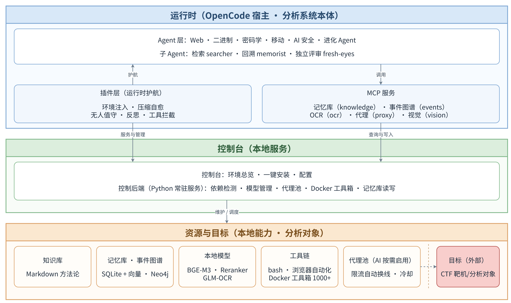

# OpenSecurity

> **English** | [中文](README.md)

> AI-driven multi-domain security analysis agent platform — making LLMs work like a real research team; since 2.0, long tasks run unattended to the finish line.

[](LICENSE)

## What is this

OpenSecurity lets an LLM complete a security analysis end-to-end: give it a target (a file, a source tree, or a URL), and it orchestrates the toolchain (IDA Pro, Frida, apktool, a browser...), pushes forward step by step, and produces a verifiable report. Not Q&A-style chat, not stopping at "I suggest you open it in IDA" — actually running the tools, reading output, reasoning, and deciding the next step.

Covers five security domains + one self-evolution engine:

| Agent | Responsibility |
|-------|---------------|
| `binary-analysis` | Binary reverse engineering: algorithm recovery, packer detection, vulnerability research |
| `mobile-analysis` | Mobile reverse engineering: APK/IPA decompilation and Java/Native analysis |
| `web-analysis` | Web security: vulnerability auditing and exploit chain construction |
| `ai-security-analysis` | AI application security: prompt injection and jailbreak attacks |
| `crypto-analysis` | Cryptography attacks: RSA/lattice/ECC/classical/symmetric/hash |
| `security-analysis-evolve` | Self-evolution: distilling reusable scripts and knowledge from real-world analyses |

Four helper agents are dispatched on demand by the main agents: `searcher` (external intelligence retrieval), `knowledge-scout` (external writeup reconnaissance and material collection), `memorist` (historical memory retrieval), and `fresh-eyes` (independent reflective review).

## Core mechanisms

1.0 does the analysis; 2.0 finishes the job on its own. Long tasks have two enemies: **stopping** (waiting for clicks or confirmations) and **drifting** (speeding down a dead end). The mechanisms below deal with them:

1. **Unattended operation**: when idle, it checks for a "completion marker"; with no marker, it injects a "keep going until done" recovery message. The marker is randomly generated each time, so the model can't fake completion. Tasks that run for tens of hours keep moving with nobody watching.
2. **Reflection**: triggered periodically based on active runtime (default 30 minutes, configurable in the console); the reminder carries run data (how long it has been running, how many tool calls in between) and asks to persist experiment results first, then take stock of direction (continue / switch / abandon / dig deeper). Busy sessions get the reminder appended to command output; idle ones get a wake-up message. Prevents speeding down a dead end.
3. **Memory store**: queryable in real time (search past experience before starting), fully logged (every tool call and result written per task, supporting compaction recovery and after-the-fact review), and self-evolving (analysis agents decide which reusable solutions to persist; the store gets thicker with use).
4. **Permission timeout auto-reject**: unanswered permission prompts are auto-rejected after a timeout (default 60 seconds, by default only for the external_directory type; both configurable), and the rejection carries guidance so the model reroutes on its own. Tasks don't stall waiting for a click.
5. **Proxy module**: when bulk scanning or verification bursts hit rate limits, it rotates to another exit automatically; rate-limited addresses are cooled down. Tasks aren't cut off by throttling or blocking.
6. **Local models**: BGE-M3 (embeddings), Reranker (re-ranking), and GLM-OCR (image text) run locally (~7.6GB in total); they can also be offloaded to another machine on the LAN. Saves money, and keeps your data in-house.
7. **Console**: starts together with the main service; environment dashboard (one-click install for whatever is missing) and configuration management (tools / models / proxy / behavior) on one screen.

> This is the state I want: **you go to sleep, it keeps working.**

## Architecture

```
.opencode/
├── agents/                  # 10 agent prompts: 5 analysis domains + evolve + 4 helpers
├── agents-rules/            # Shared prompt snippets (auto-expanded by Plugin)
├── plugins/                 # Plugin layer: persistence / interception / unattended / reflection (security-analysis.ts + lib/)
├── commands/                # Slash commands (/ctf-events, /write-writeup, /knowledge-search, ...)
├── skills/                  # On-demand skills (reflection-protocol, ...)
├── control/                 # Console (local service: backend + frontend)
├── mcp-servers/             # MCP servers: knowledge / events / ocr / proxy / vision
├── tools/                   # Platform binaries (class-dump, ldid, optool, ...)
├── wordlists/               # Wordlists
├── install.sh / install.ps1 # One-shot environment install (Python deps + external tools)
├── binary-analysis/         # Per-domain: tool scripts + knowledge base (binary-analysis is the shared layer)
├── crypto-analysis/
├── mobile-analysis/
├── web-analysis/
├── ai-security-analysis/
├── security-analysis-evolve/# Evolve engineer's own directory
├── knowledge-scout/         # Knowledge scout's own directory
└── requirements/evolve/     # Evolution requirement docs
```

**Three-layer separation**:
- **AI orchestration layer**: Agent prompts (when to call which tool, how to reason), executed by the LLM
- **Tool layer**: Python / Bash scripts (query.py, update.py, initial_analysis.py...), maintained by engineers
- **Knowledge base layer**: On-demand Markdown (packer handling strategies, Unicorn templates, Frida quick reference...), continuously distilled by the evolve agent

Key design decision: **the LLM never operates GUIs directly**. All IDA operations go through `idat -A -S<script>` headless mode + IDAPython scripts, ensuring the analysis process is reproducible.

**Figure 1: System architecture. The runtime (OpenCode host) calls the console (local service); the console depends on Resources & Targets (local capabilities · analysis targets):**



## Version status: 2.0 (hardware requirements & availability)

`master` currently carries 1.0. 2.0 is feature-complete and battle-tested (see the [2.0 field notes](./docs/项目介绍/2.0-实战博文/01-无人值守完成CTF挑战.md), in Chinese), but **has not been merged into master yet**, because of its hardware requirements; it will be merged in due course.

Hardware requirements (test machine: MacBook Pro / M4 Pro / 48GB):

| Item | Usage |
|---|---|
| OS + base software | ~8GB |
| Local models ×3 (BGE-M3 / Reranker / GLM-OCR) | reserve ~12GB when loading (~7.6GB in total) |
| Docker + Neo4j | ~2GB |
| Main service + console | ~3GB |
| Headroom for analysis tasks | 8GB+ |

**32GB RAM minimum, 48GB recommended**; add 25GB+ of disk for tool images and model caches. If your machine is light, the models can be offloaded to another machine on the LAN (remote inference node).

Hardware OK → pull **Tag ≥ 2.0**; otherwise stay on master (1.0).

## Quick Start

### Prerequisites

| Dependency | Version | Notes |
|-----------|---------|-------|
| [OpenCode](https://github.com/anomalyco/opencode) | latest | AI agent framework, this platform is built on top of it |
| Python | 3.8+ | Script runtime (Plugin auto-creates venv) |
| IDA Pro | 7.6+ | Required for binary reverse engineering (only `binary-analysis` / `mobile-analysis`) |
| C/C++ compiler | any | For compute-intensive tasks (macOS: clang / Linux: gcc / Windows: VS Build Tools) |

Mobile / Web / AI security analysis also require domain-specific tools (Frida, apktool, jadx, Playwright...). Before each message, the plugin checks the environment: if the bootstrap layer (Python environment and dependencies) is missing, it points you to `install.sh`; once past that, the console runs the full check (Python packages / external tools / compiler / Docker / models) and blocks the conversation with a console link when required dependencies are missing — install them with one click in the console.

**Figure 2: Console dashboard. Readiness of Docker, models, Python packages, and external tools on one screen; install whatever is missing with one click:**


### Installation

```bash
# 1. Clone the repo (with submodules, recommended for first clone)
git clone --recursive https://github.com/zylc369/OpenSecurity.git
cd OpenSecurity

# Already cloned but missed submodules? Pull them:
# git submodule update --init --recursive

# 2. Symlink .opencode/ to your workspace (or global config)
# Option A: project-level (recommended, only affects this directory)
ln -s "$(pwd)/.opencode" ~/your-workspace/.opencode

# Option B: global (affects all projects)
ln -s "$(pwd)/.opencode" ~/.config/opencode

# 3. Install environment dependencies (Python deps + external tools; the plugin also points here when something is missing)
bash .opencode/install.sh   # use install.ps1 on Windows
```

> **About submodules**: `vendor/` contains reference source code for OpenCode, Frida, IDA SDK, etc. Useful for browsing but not required to run. If disk space is tight, skip `--recursive` — core functionality doesn't depend on them.

### Configure IDA Pro

IDA Pro path is specified via `IDA_PRO_HOME` (IDA Pro install directory). Either:

- Open the console (`http://localhost:5173/`, auto-started after the first message) and set `IDA_PRO_HOME` on the config page
- Or edit `$OPENCODE_ROOT/.ai_env` (a commented template is created on first console start):

```ini
# $OPENCODE_ROOT/.ai_env
IDA_PRO_HOME=<IDA Pro install directory>
```

Once configured, the plugin injects `$IDAT` (full idat path) into the agent shell. Environment status (Python packages / external tools / compiler / Docker / models) is visible on the console dashboard.

### Your First Analysis

```bash
# Start OpenCode in your workspace
cd ~/your-workspace
opencode
```

Switch to the appropriate domain agent in the TUI, then drop a message:

```
Reverse engineer /Users/me/Downloads/crackme.exe and find the correct license
```

The agent autonomously completes: information gathering → analysis planning → tool execution → result verification → report generation. Intermediate artifacts are persisted under `~/bw-security-analysis/workspace/<task_id>/`, including decompiled output, screenshots, solver scripts, and the final report.

### Common Slash Commands

Common actions around an analysis task are available as slash commands — type the command name in a session:

| Command | What it does |
|---------|--------------|
| `/ctf-events` | CTFtime overview: ongoing (sorted by time left) and upcoming (sorted by start time) events |
| `/create-challenge-doc` | Faithfully archive a challenge from its website: local analysis doc + raw attachments (no extraction, no interpretation) |
| `/knowledge-search` | External writeup reconnaissance: gap comparison against the knowledge base, value assessment, material download, distillation shortlist |
| `/write-writeup` | Generate a teaching-style analysis report to a fixed spec: prerequisites, attack chain, full reproduction, defense advice |
| `/analysis-attribution` | Mechanism attribution: how much of a completed task came from architecture mechanisms (runtime recovery / working memory / sub-agents / knowledge & memory / toolchain) vs. model reasoning |

## Data & Code Separation

| Category | Location | Tracked in git |
|----------|----------|---------------|
| **Code** | `.opencode/` | Yes |
| **Runtime data** | `~/bw-security-analysis/` | No (venv, config, workspace, logs) |
| **Private config** | `.privacy-data/` | No (API keys, etc.) |

## Documentation

| Document | Content |
|----------|---------|
| [Project Deep Dive](docs/项目介绍/open-security-介绍.md) | Design philosophy, architecture details, counterintuitive decisions (Chinese) |
| [2.0 Field Notes](docs/项目介绍/2.0-实战博文/01-无人值守完成CTF挑战.md) | Unattended CTF solving: the 2.0 field record (Chinese) |
| [Knowledge & Memory System](docs/项目介绍/知识与记忆体系.md) | Read/write mechanics of the knowledge base and memory store (Chinese) |
| [New Machine Setup Guide](docs/项目介绍/新机器配置指南.md) | Setting up the whole system on a fresh machine (Chinese) |
| [Adding a New Agent](docs/contributing/add-new-agent.md) | Extending the platform with new security domains |
| [Roadmap](docs/ROADMAP.en.md) | Project roadmap and future directions |
| [Plugin Development](https://github.com/zylc369/OpenSecurity/blob/main/.opencode/binary-analysis/knowledge-base/opencode-plugin-development-guide.md) | OpenCode Plugin engineering practices |
| [IDAPython Conventions](https://github.com/zylc369/OpenSecurity/blob/main/.opencode/binary-analysis/knowledge-base/idapython-conventions.md) | Tool script coding standards |
| [ai-dialogue Tool](docs/项目介绍/ai-dialogue.md) | General AI dialogue tool: talk to target models via opencode serve (Chinese) |

## Contributing

All forms of contribution are welcome: new agents, new tool scripts, knowledge base additions, bug fixes, documentation improvements.

See [CONTRIBUTING.en.md](CONTRIBUTING.en.md) for details.

Special directions we'd love help with (see [Roadmap](docs/ROADMAP.en.md)):
- IPA analysis enhancement
- AI security attack methodology distillation
- Windows kernel driver analysis
- Web security knowledge base for more frameworks

## License

[Apache-2.0](LICENSE)
