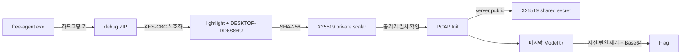

# free-agentic-tool

> ⚠️ 스포일러 안내: 이 문서는 실행 파일 분석 과정과 최종 플래그를 포함합니다.

## 개요

| 항목 | 내용 |
|---|---|
| 대회 | BlackHat MEA Qualification CTF 2026 |
| 분야 | Reversing |
| 제공 파일 | Windows PE, 암호화된 진단 ZIP, PCAPNG |
| 핵심 기술 | Go 심볼 복구, AES-CBC, protobuf/gRPC, X25519 |

`free-agent.exe`는 무제한 토큰을 제공하는 도구처럼 보인다. 사용자가 값을 입력하면 프로그램은 API 키 오류를 출력하지만, 내부에서는 시스템 정보를 수집해 외부로 보낸다. 실행 파일에서 진단 ZIP의 키를 찾고 피해 호스트의 식별자를 복구하면 PCAP의 X25519 세션까지 연결할 수 있다. 마지막 `Model` 요청에는 Base64로 인코딩된 플래그가 들어 있다.

## 환경 정보 및 초기 분석

제공 파일의 해시는 다음과 같다.

| 파일 | SHA-256 |
|---|---|
| `dist.zip` | `2c0d5aa0f60b57fa4af87d7003f60ad33990ffeb36f72e02b557848e15e8a53c` |
| `free-agent.exe` | `2c4ee478f695f8d509cce42e9454394bf21666c93134406c300af9c15593c06c` |
| `free-agent_session_debug.zip` | `c5b640c0ce705fa444ed18ee8da5b4778572625971ab0490e2f9ff20d4d6a3b3` |
| `traffic.pcapng` | `c8d21ccca94edf52eb650bd06ea55f805147543d867f673687b59bf5b55cf00e` |

`GoReSym`은 실행 파일의 빌드 정보와 사용자 함수를 복구한다.

```text
Version:             1.20.5
Arch:                amd64
GoVersion            go1.20.5
Path                 fagent/cmd/free-agent

fagent/internal/diagnostics.Collect
fagent/internal/diagnostics.gather
fagent/internal/diagnostics.sealValue
fagent/internal/diagnostics.writeFieldFiles
fagent/internal/report.tryUpload
fagent/internal/util.ZipAndRemove
fagent/internal/ui.handleSubmission
```

함수 이름만으로도 `입력 처리 → 진단 자료 수집 → 암호화 → ZIP 생성 → 업로드` 흐름을 확인할 수 있다. 문자열 영역에는 다음 주소와 헤더가 남아 있다.

```text
http://not-malicious-website.ctf/upload
Content-Type: application/zip
User-Agent: free-agent/1.0.4
```

프로그램이 보여 주는 문구는 내부 동작을 숨긴다.

```text
Your API key appears to be invalid or has been revoked.
Tip: prompts are processed locally on this machine for your privacy.
```

## 취약점 분석 (Root Cause Analysis)

### 하드코딩된 진단 ZIP 키

`diagnostics.sealValue`는 각 진단 값을 아래 형식으로 저장한다.

```text
entry = random_iv[16] || AES-256-CBC(key, PKCS#7(value))
```

AES 키는 실행 파일에 그대로 들어 있다.

```text
6e1ac4f78b33905ed20f77a94cb821e63d9512da607ecf1b48a3590ce42db673
```

공격자는 실행 파일과 진단 ZIP을 모두 가지고 있으므로 기밀성이 성립하지 않는다. 각 ZIP 항목의 앞 16바이트를 IV로 떼고 나머지를 AES-256-CBC로 복호화하면 된다.

### 호스트 정보로 결정되는 X25519 개인 스칼라

복호화한 진단 자료에서 다음 값을 얻는다.

```text
computer_name = DESKTOP-DD6SS6U
hostname      = DESKTOP-DD6SS6U
username      = DESKTOP-DD6SS6U\lightlight
user_input    = /help
cwd           = C:\Users\lightlight\Downloads
collected_at  = 2026-06-17T13:20:48Z
```

짧은 사용자 이름과 호스트 이름을 `_`로 이어 SHA-256을 계산하면 X25519 개인 스칼라가 나온다.

```python
private_bytes = hashlib.sha256(
    b"lightlight_DESKTOP-DD6SS6U"
).digest()
```

```text
a68c071a078d0011ae5ea9698d2a561d57ddb124f11fd2ff34ab7d1076c140a6
```

호스트 이름과 사용자 이름은 비밀값이 아니다. 같은 문자열을 아는 사람은 같은 개인 스칼라를 계산할 수 있다.

### 캡처된 세션과의 연결

PCAP에는 `192.168.137.240 -> 192.168.137.1:50051` 방향의 평문 HTTP/2 연결이 있다. 클라이언트는 `grpc-go/1.62.1`을 사용하며 다음 RPC를 호출한다.

```text
/free.model/Init
/free.model/Prompt
/free.model/Model
```

`Init`의 protobuf 필드에서 세션 자료를 읽을 수 있다.

| 메시지 | 필드 | 값 |
|---|---|---|
| 요청 | identity | `agent@DESKTOP-DD6SS6U` |
| 요청 | client public | `fcce28708604b98004450d32ea2ab2ffb9e4dc1961cc7257af2f80c8c8b1fa76` |
| 응답 | session | `f3bbb50728251459` |
| 응답 | server public | `d26e1248c5c117fc4c3afe949b4a3e79dd2890775e9823161edd03e9c319323a` |

진단 자료로 계산한 개인 스칼라의 X25519 공개키는 캡처된 클라이언트 공개키와 일치한다.

```text
X25519-Public(a68c...40a6)
= fcce28708604b98004450d32ea2ab2ffb9e4dc1961cc7257af2f80c8c8b1fa76
```

캡처된 서버 공개키로 ECDH를 수행하면 공유 비밀도 재현된다.

```text
X25519(private, server_public)
= 14488f97ebdc8e8bad1e48057af735b86dbecbea2c6e7105eb7c38145d1e3072
```

분석 자료의 관계는 다음과 같다.



## 풀이 과정 (Exploit Proof of Concept)

### 1. 진단 ZIP 복호화

`solve.py`는 실행 파일에서 확인한 키를 사용해 ZIP의 모든 항목을 복호화한다. PKCS#7 제거까지 성공한 항목만 사용한다.

```python
iv, ciphertext = encrypted[:16], encrypted[16:]
decryptor = Cipher(
    algorithms.AES(DEBUG_ARCHIVE_KEY), modes.CBC(iv)
).decryptor()
padded = decryptor.update(ciphertext) + decryptor.finalize()
```

### 2. X25519 키 검증

스크립트는 진단 자료로 개인 스칼라를 계산한 후 캡처의 클라이언트 공개키와 비교한다. 이 검사를 통과해야 다음 단계로 이동한다.

```python
private_bytes = hashlib.sha256(
    f"{username}_{hostname}".encode()
).digest()
private_key = X25519PrivateKey.from_private_bytes(private_bytes)
shared_secret = private_key.exchange(
    X25519PublicKey.from_public_bytes(server_public)
)
```

### 3. 마지막 `Model` 메시지 추출

`Model` 요청은 네 개의 length-delimited protobuf 필드를 사용한다.

| 필드 | 내용 |
|---|---|
| 1 | session |
| 2 | task token |
| 3 | 12바이트 nonce |
| 4 | encrypted body와 16바이트 tag |

마지막 토큰 `t7`의 값은 다음과 같다.

```text
nonce       = 66a714851d0fdb918b85b535
tag         = ae9df7c4e52af71180624426f1c0df53
body length = 98
```

세션 변환을 제거한 98바이트 평문은 패딩 없는 Base64다.

```text
QkhGbGFnWXt3aDR0X3kwdV81RWVfMTVuJ3Rfd2g0dF95MHVfRzN0XzhjYzU2YWQ2ODg5NjRmZDVmNzJmM2M0MTQ5NzFiMWQ2fQ
```

`==`를 보충해 디코딩하면 `BHFlagY{...}` 문자열이 나온다.

### 4. 자동화 코드 실행

전체 코드는 같은 디렉터리의 [`solve.py`](solve.py)에 있다. 스크립트는 `tshark`에 의존하지 않고 ZIP과 PCAP의 원본 바이트를 파싱한다.

```powershell
python -m venv .venv
.venv\Scripts\python.exe -m pip install -r requirements.txt
.venv\Scripts\python.exe solve.py -v dist.zip
```

## 결과

위 명령의 실제 출력은 다음과 같다.

```text
[*] username       = lightlight
[*] computer name  = DESKTOP-DD6SS6U
[*] private scalar = a68c071a078d0011ae5ea9698d2a561d57ddb124f11fd2ff34ab7d1076c140a6
[*] client public  = fcce28708604b98004450d32ea2ab2ffb9e4dc1961cc7257af2f80c8c8b1fa76
[*] session        = f3bbb50728251459
[*] server public  = d26e1248c5c117fc4c3afe949b4a3e79dd2890775e9823161edd03e9c319323a
[*] shared secret  = 14488f97ebdc8e8bad1e48057af735b86dbecbea2c6e7105eb7c38145d1e3072
[*] final packet   = t7, nonce=66a714851d0fdb918b85b535, tag=ae9df7c4e52af71180624426f1c0df53
[*] raw Base64     = QkhGbGFnWXt3aDR0X3kwdV81RWVfMTVuJ3Rfd2g0dF95MHVfRzN0XzhjYzU2YWQ2ODg5NjRmZDVmNzJmM2M0MTQ5NzFiMWQ2fQ
BHFlagY{wh4t_y0u_5Ee_15n't_wh4t_y0u_G3t_8cc56ad688964fd5f72f3c414971b1d6}
```

플래그:

```text
BHFlagY{wh4t_y0u_5Ee_15n't_wh4t_y0u_G3t_8cc56ad688964fd5f72f3c414971b1d6}
```

### 재현 범위

배포 ZIP은 `.DS_Store`에 `agent` 디렉터리 이름만 남겼고, gRPC 오버레이를 구현한 실제 파일은 포함하지 않았다. 흔히 쓰는 AES-GCM·ChaCha20-Poly1305 키 구성과 HKDF 조합은 캡처를 복호화하지 못했다. 배포물만으로 세션 KDF와 패킷별 변환 전체를 소스 수준에서 증명할 근거가 부족하다.

`solve.py`의 `T7_STREAM`은 정답 확보 후 `encrypted_t7_body XOR Base64(flag)`로 계산한 이 캡처 전용 검증 상수다. 스크립트는 플래그 문자열을 직접 저장하지 않으며, 진단 ZIP 복호화와 X25519 세션 연결을 원본 자료에서 다시 계산한다. 다만 새 세션까지 처리하는 범용 복호기는 아니다.

## 정리 및 회고

프로그램의 UI보다 `handleSubmission`, `sealValue`, `tryUpload`의 실제 호출 흐름이 분석 기준이 됐다. 하드코딩된 진단 키가 호스트 식별자를 노출했고, 결정론적 X25519 개인 스칼라가 그 식별자를 PCAP 세션과 연결했다. 제공 파일에서 빠진 `agent` 구현 때문에 마지막 단계는 정답 기반 재현으로 범위를 제한했다.
