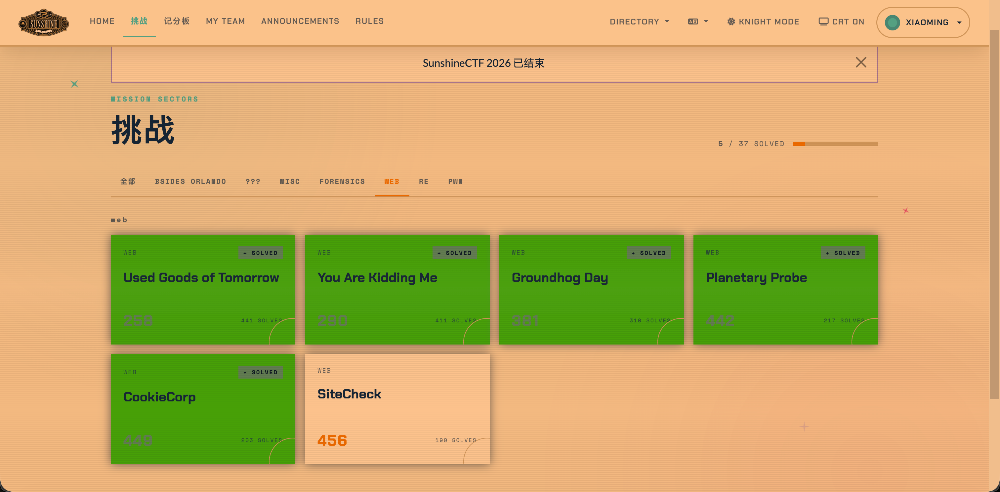
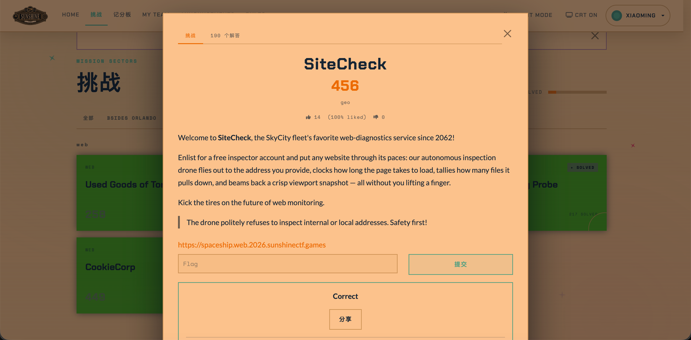
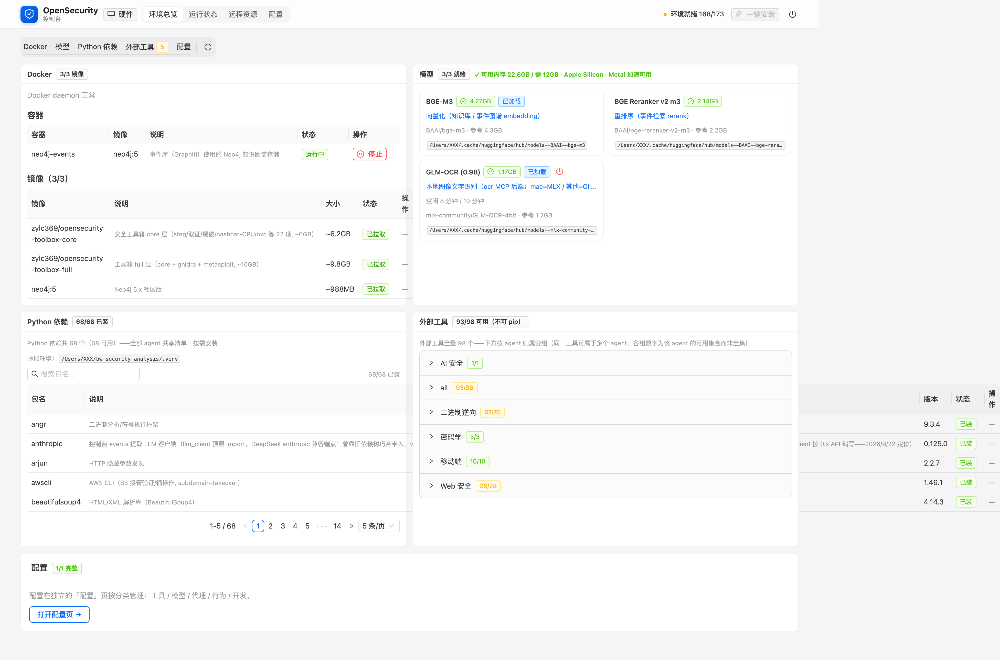
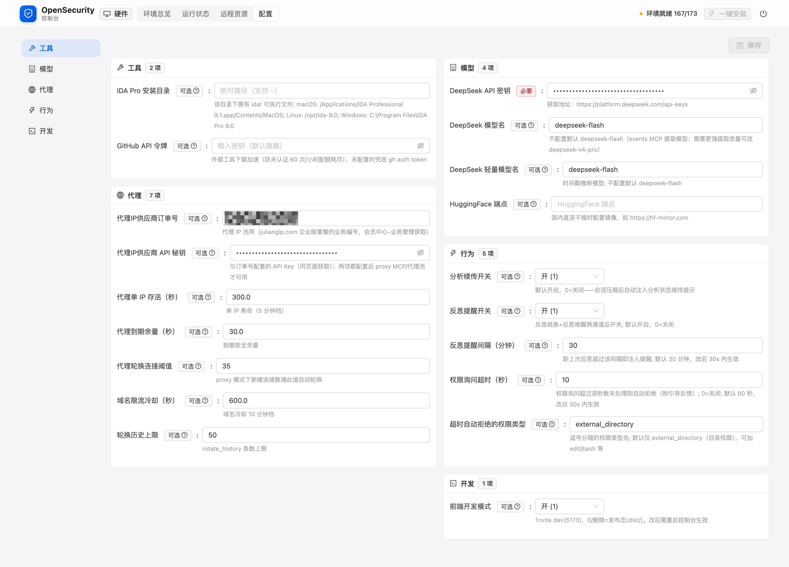

# 无人值守完成 CTF 挑战

## Security Analysis 2.0 是什么

它是一套多 agent 安全分析系统，覆盖 Web、二进制、密码学、移动、AI 安全五个方向，跑在 OpenCode 之上的安全分析系统，它的特点：

1. **知识和经验自动化**：知识库与记忆库承载知识和经验，一个是文档型，一个是存储在图数据库、向量库中，其中的记忆库能无人干预的自动进化。
2. **纠正歧路**：新增反思机制让AI能纠正歧路，尽快的分析出结果。
3. **自动完成分析**：另有无人值守、代理等一组机制，让任务完成前不会停止、卡壳、被迫暂停、被迫中断。

一句话版本差异：**1.0（master 分支）会做分析；2.0 让它独立把任务做完。**

## 实战记录

> Security Analysis 2.0 实战记录 · SunshineCTF 2026

**先给结论：我们的安全分析系统在 SunshineCTF 2026 上解出了一批 CTF 题——从启动到交出答案，全程无人值守。** 这不是演示，是真实赛题上的战绩：系统负责解题，人只负责两件事——给题，和提交。



*图 1：SunshineCTF 2026 的 Web 题区——图中标记为 SOLVED 的题目，均由本系统完成。*



*图 2：SiteCheck（456 分）——提交判题通过（Correct）。*

**先解释图 1 里唯一没变绿的 SiteCheck。** 为控制成本，我们的分析任务避开模型计费的高峰时段、只在早上和晚上推进；SiteCheck 是这批题里被卡得最久的一道，战线因此跨过了赛事结束时间。但赛后题目实例仍在线、平台也仍接受判题——图 2 就是赛后提交的判题结果：**Correct**。它没赶上计分板，但被完整解出来了。

这批题（全部 Web 方向）：

- **Used Goods of Tomorrow**——2 分钟拿下：未授权接口泄露高权限凭证 → 零元购 → flag。
- **You Are Kidding Me**——JWT 的 kid 头注入：签名密钥可被指定，伪造管理员凭证。
- **Groundhog Day**——gopher 协议 SSRF，直通服务端渲染链读文件。
- **CookieCorp**——Cookie Jar 溢出：把管理员机器人浏览器里的身份"挤"出去。
- **Planetary Probe**——单比特盲注起步，一路打到数据库命令执行。
- **SiteCheck**——本文主角（456 分、190 队解出）：一道"提交 URL、无人机访问并截图"的 SSRF 题，也是把这套系统的机制用到最满的一道，详见后文拆解。

## 整体架构：各模块如何协作

先看一张图——这些模块是怎么协作的：

```
  人：切换最合适的Agent
    │
    ▼
  人：给题
    │
    ▼
  分析 Agent（Web / 二进制 / 密码 / 移动 / AI 安全）
    │
    ├──▶ 工具链（bash / 浏览器 / 1000+ 工具）──▶ 代理模块（限流时自动换线路）
    │
    ├──▶ 知识库 + 记忆库（MCP 实时查询 / 自动沉淀）──▶ 本地模型（向量化 / 重排序 / OCR）
    │
    └──▶ 插件层（运行时护航）：无人值守（防停）+ 反思（定期盘点）
    │
    ▼
  答案（flag）──▶ 人：提交
```

一句话读懂：**人只出现在两端**。分析 Agent 负责干活——它用工具链、经代理模块访问网络；用知识库查方法论、用记忆库做实时查询与自动沉淀（记忆库的向量化由本地模型完成）；插件层在运行时全程护航：停下了就推回去（无人值守），跑久了就提醒盘点（反思）。下面逐块展开。

## 功能模块

### 知识库：系统的战术手册

按方向组织的方法论文库。它不只是资料堆——每个方向都写明"什么场景、用什么打法、具体命令是什么、怎么判断成败"。它是"慢资产"：不自动生长，每次更新都来自复盘后的提炼。**用途：让系统面对陌生题目时，先查手册再动手。**

### 记忆库：实时可查、自动进化的经验库

记忆库有两个特点：
1. **实时查询**：通过 MCP 接口，分析 Agent 在解题过程中可以随时检索过往任务的知识与经验，命中的条目直接回到当前上下文。
2. **自动进化**：每次任务的发现与解法自动沉淀为条目（本次 SiteCheck 的解法在完成后自动落库），下一次任务即可召回——库自己越用越厚。**用途：让系统每次都在上一轮经验之上开工。**

### 反思模块：长跑的纪律保险丝

长任务里最贵的错误，是在死路上闷头加速。反思模块按"距上次盘点时长 × 工具调用密度"的**数字规则**定期触发（默认 30 分钟）：忙碌时把一条**反思提醒**附在命令输出之后（不打断工作），空闲时发一条唤醒消息；配套协议要求先落盘实验结果，再做方向盘点（继续 / 换向 / 放弃 / 深挖）。**用途：防止长任务跑偏。**

### 无人值守模块：没人盯着，任务也不会停

AI 跑长任务最大的敌人是"停"——模型给出阶段性结论后就会安静等人。这套机制在系统空闲时检查"完成标记"：没有标记，就注入"未完成就继续做"的恢复消息；模型真正完成时输出标记，机制自停。标记每次随机生成，防止模型学会"假装完成"。**用途：几十小时级的任务，没有人盯着也能推进。**

### 代理模块：让任务不被限流掐断

批量扫描、验证这类"大轰炸"阶段最容易触发目标限流。代理模块的作用是：一条线路被限流，就自动换另一条；被限流的地址先冷却一段时间、暂不触碰。**用途：任务不因限流、封锁而中断。**

### 本地模型：配合记忆库，顺带省钱

记忆库的"存"与"查"，需要把内容变成向量。存知识时算一次、查知识时算一次，语义相近就能匹配（哪怕用词不同）。这一步由本地模型 **BGE-M3** 完成；检索出的候选再由本地 **Reranker**（重排序模型）按相关性排序；截图里的文字（比如 SiteCheck 的 flag）则由本地 **OCR** 模型提取。

为什么放在本地？一个直接原因是**省钱**：当前这台设备的硬件足以运行这三个模型（合计约 7.6GB），本地推理的边际成本几乎为零。当然，这是有条件的，如果你的硬件不如这台、跑不动本地模型，可以把模型卸载到局域网里的另一台机器（远程推理节点），或者用线上模型。

### 控制台：随服务端一起启动

系统还带一个控制台——它随服务端一起启动，浏览器打开 `http://localhost:5173/` 就能看到。控制台是整套系统的"驾驶舱"：

- **环境总览**（首页）：Docker、模型、Python 依赖、外部工具四类环境的就绪状态一屏可见，缺什么一键安装；
- **配置页**（`#/config`）：工具（IDA 路径、GitHub 令牌）、模型（API 密钥）、代理（轮换阈值、限流冷却）、行为（续传开关、反思提醒间隔）等参数都在这里管理。



*图 3：控制台首页——Docker、模型、Python 依赖、外部工具的就绪状态一屏可见。*



*图 4：控制台配置页——工具、模型、代理、行为、开发五类配置。*

> 另有一组支撑件不单独展开：任务路由（给每道题挑最合适的 agent）、子 agent 体系、任务目录与工作记忆、以及 1000+ 安全工具组成的工具链。

## 实战拆解：SiteCheck

**题目**：SiteCheck 是一个"网站体检"服务——提交一个 URL，它派一架自动巡检无人机去访问、记录加载时间、回传一张截图，并且"礼貌地拒绝访问内网地址"。翻译成安全语言：这是一道 SSRF（服务端请求伪造）题，而真正的考点在于"无人机"：它自带一个完整的浏览器环境和一套自己的登录会话。

破局的攻击链只有四步：

1. 过滤器的字面黑名单拦掉了 `127.0.0.1`、`127.1`、`0x7f000001` 等 IPv4 字面量，但放行了 IPv6 环回 `[::1]`；
2. 无人机自带一个管理员登录会话，且这个会话只绑定在 `[::1]` 这个宿主形态上（用 `localhost.` 等等价写法访问同一页面，只会得到登录页）；
3. 用 URL 锚点 `#clearance` 把页面底部（1400 像素空白之后）的受限区滚进视口——截图窗口只有 800 像素高，默认拍不到；
4. 从回传的截图里读出 flag：`sun{fr4gm3nt3d_r3fl3ct10ns_1n_th3_futur3}`。

**过程**：09-27 开跑，09-29 凌晨破局（跨约 32 小时）——受"只在早晚跑"的成本策略影响，战线被拉长。赛后提交，判题通过（图 2）。下面按模块拆开看：这道题里，系统到底靠什么把仗打完。

### 各模块在这道题里的体现

**知识库**：Web 方法论（分析流程、证据纪律）贯穿全程；决定性的技法（换等价宿主形态）是现场实验的产物——战后的复盘把它提炼成一条通用战术（"截图类机器人：宿主形态矩阵"），补进了知识库手册。

**记忆库**：解题成果自动沉淀——解法条目在完成后自动落库，此后按技法词回查可稳定召回。它的意义在下一道同类题：不用再花 32 小时。

**反思模块**：这道题的分析过程中，它 4 次触发（08:21 / 08:55 / 09:26 / 09:58；间隔 32 / 35 / 31 / 32 分钟，每次背后是 94 / 65 / 40 / 39 次工具调用）；第一条反思提醒出现 22 秒后，系统就加载了配套的反思协议。它不是灵感来源，是纪律：把长跑切成段、定期交作业，防止在死路上闷头加速。

**无人值守模块**：这道题的破局就是它完成的——空闲时它注入了一条"未完成就继续"的恢复消息，把停下的任务重新推动起来：94 秒后关键实验完成，137 秒后 flag 到手。它还纠正过一次"假完成"：模型交卷说"分析完成"，但没有输出完成标记，机制不认账、把它推回去继续（事后证明推得对：那时离解出还有 38 分钟）；最终检测到正确标记、自动停止。

**代理模块**：这道题的扫描与批量验证阶段持续密集、高并发——期间共 16 次自动换线路，任务无需暂停等待、始终保持高并发，没有中断。

**本地模型**：flag 就是从无人机截图里读出来的——本地 OCR 文字识别两次 + 直读，三方交叉验证；记忆库的"存"与"查"，向量化与重排序由本地模型完成。

## 2.0 的硬件要求与获取

2.0 把不少能力放到了本地运行，对机器有一定要求。以下是我们测试机（MacBook Pro / M4 Pro / 48GB 统一内存）上的实际占用：

| 项 | 占用 | 说明 |
|---|---|---|
| 操作系统与基础软件 | ~8GB | 系统本身 + 编辑器、浏览器等日常软件 |
| 本地模型 ×3 | 加载需预留 ~12GB | BGE-M3（4.3GB，向量化）/ Reranker（2.1GB，重排序）/ GLM-OCR（1.2GB，图像文字识别），合计约 7.6GB |
| Docker + Neo4j | ~2GB | 事件图谱数据库（neo4j-events 容器） |
| 主服务 + 控制台 | ~3GB | OpenCode 主进程 + 控制台前后端 |
| 分析任务余量 | 8GB+ | 浏览器自动化、扫描 / 爆破工具、镜像处理等 |

**建议：内存 32GB 起步，48GB 更从容**（Apple Silicon 走统一内存 + Metal 加速；其他平台的本地模型可走 Ollama / torch 后端，独显按约 8GB 显存预留）。磁盘另需 25GB+（工具镜像与模型缓存）。

机器不够强也有出路：系统支持把三个模型**卸载到局域网里的另一台机器**（远程推理节点——我们就是让一台闲置的 Mac Mini 来分担），本机内存占用随之释放。

**关于版本**：因为 2.0 对硬件有上述要求，它暂时**还没有合并到 master**；一段时间后，它一定会合并进 master。硬件符合要求的读者，现在就可以拉取 **Tag ≥ 2.0** 的版本使用。

## 收尾

把这批战绩放在一起看，共同点很清晰：没有一道题是"一把脚本"能解决的——每一道都要走完同一个循环：**查手册、动手试、盯过程、做沉淀**。系统把循环跑完了，人只出现在两端：给题，和提交。

SiteCheck 是其中最能说明问题的一道。它被卡得最久，也因此把 2.0 的机制全部用上了：长跑中，反思定期校准方向；停下的瞬间，无人值守把任务重新推起来；高并发里，代理顶住限流、不让任务断线；每一次战果，由知识 / 记忆收下，成为下一道题的起点。1.0 会做分析；2.0 让分析在没人盯着的时候，也能自己跑到终点。

这就是我们想要的状态——**你去睡觉，它继续干活。**

> 本文数据均来自系统运行日志（注入、标记、提醒、线路切换、检索），可逐条复盘。
